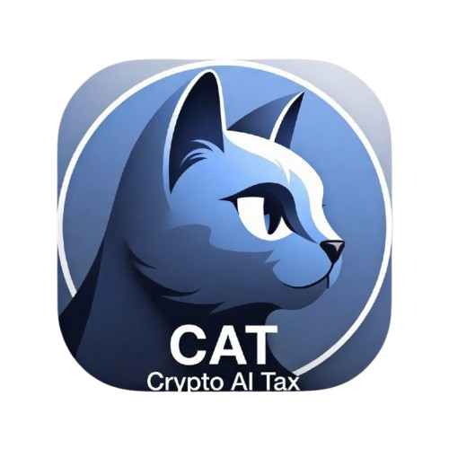

  
  <h1>CAT (Crypto AI Tax Assistant)</h1>
  
<strong>trac1qxd80ulwx4lhauqrpgn779php3g6mq3j7rwddg6s88km0qz2hm0stf9jkw</strong>

<h2>Overview</h2>

  CAT is an autonomous, AI-powered tax assistant designed for the multi-chain crypto ecosystem. It solves the complexity of cross-chain tax reporting by automatically aggregating transaction data, identifying taxable events, and generating country-specific, ready-to-file tax documents.

<h2>Key Features</h2>
<ul>
  <li><strong>Multi-Chain Sync:</strong> Connect Ethereum, Polygon, Solana, Bitcoin, and Trac Network wallets.</li>
  <li><strong>AI Tax Engine:</strong> Powered by OpenAI gpt-4o to generate reports compliant with local regulations (e.g., Nigeria FIRS, US Form 8949).</li>
  <li><strong>Tether WDK Integration:</strong> Utilizes the Tether Wallet Development Kit for robust, read-only access to EVM, Solana, and Bitcoin on-chain data.</li>
  <li><strong>Trac Network Intercom:</strong> A decentralized communication module that allows users to chat with the AI assistant about their tax positions directly via the Trac Network.</li>
  <li><strong>Official Exports:</strong> Download reports as CSV or print professional-grade PDFs formatted for official submission.</li>
</ul>

<h2>Technical Architecture</h2>

<h3>Tether WDK Integration</h3>

  CAT leverages <code>@tetherto/wdk</code> to interact with multiple blockchains without requiring private keys. By using <code>WalletAccountReadOnly</code> classes, the app securely fetches transaction histories across disparate networks (EVM, BTC, SOL) and normalizes the data for tax calculation.

<h3>Intercom Module</h3>

  The Intercom feature is built as a creative implementation of the Trac Network's communication capabilities. It provides a secure, context-aware chat interface where the AI assistant analyzes the user's specific transaction history to provide real-time guidance on capital gains, losses, and tax liabilities.

<h2>Demo</h2>

  <a href="./demo.mp4">
    ▶️ Click here to watch the demo
  </a>

<h2>Installation & Setup</h2>
<pre>
<code>
npm install
npm run dev
</code>
</pre>

Built for the future of decentralized finance and tax compliance.

